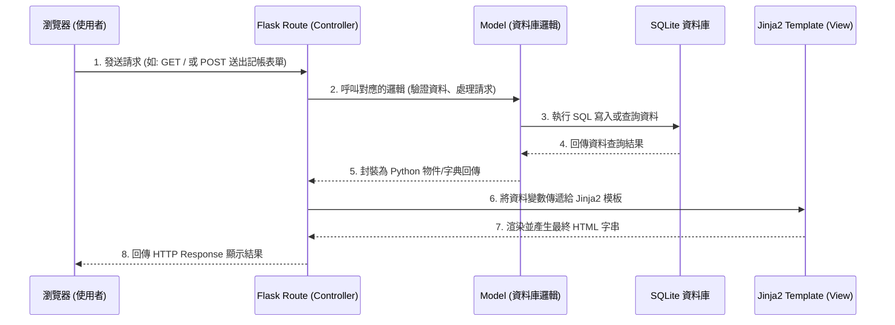

# 個人記帳簿系統 - 系統架構設計 (Architecture)

## 1. 技術架構說明

本系統採用經典的 **MVC (Model-View-Controller)** 架構模式來組織程式碼，且不採用前後端分離，以確保專案結構簡單、易於開發與維護。

- **選用技術與原因**：
  - **後端 (Python + Flask)**：Flask 是一個輕量且彈性的網頁框架，非常適合用來快速開發中小型應用程式與實作個人專案。
  - **前端 (Jinja2 + 原生 Web 技術)**：Jinja2 是 Flask 內建的模板引擎，負責在伺服器端將資料動態渲染至 HTML 頁面。不使用複雜的現代前端框架 (如 React/Vue) 可以大幅節省開發建置的時間，快速驗證核心點子。
  - **資料庫 (SQLite)**：輕量級關聯式資料庫，所有資料都存放在單一本機檔案中。不需架設與維護額外的資料庫伺服器，非常符合個人記帳簿的輕量化需求。

- **Flask MVC 模式說明**：
  - **Model (資料模型)**：負責與 SQLite 互動。定義資料的 Schema（如：收支紀錄、分類、帳戶），並處理資料的增刪改查 (CRUD) 邏輯。
  - **View (視圖)**：負責將資料呈現給使用者。這裡由 `app/templates/` 內的 Jinja2 HTML 檔案擔任，負責介面佈局與資料的展示。
  - **Controller (控制器)**：由 Flask 的路由 (Routes) 擔任。負責接收瀏覽器的 HTTP 請求，向 Model 獲取或更新資料，最後將資料傳遞給 View 進行渲染，再回傳給使用者。

---

## 2. 專案資料夾結構

為了讓程式碼好維護、團隊分工明確，專案目錄規劃如下：

```text
web_app_development/
├── app.py                 # 應用程式的啟動入口，負責啟動 Flask 開發伺服器
├── requirements.txt       # 紀錄專案依賴的 Python 套件
├── instance/              # 存放本地端環境與執行期產生的檔案
│   └── database.db        # SQLite 資料庫檔案 (需加入 .gitignore 避免上傳)
├── docs/                  # 專案說明文件
│   ├── PRD.md             # 產品需求文件
│   └── ARCHITECTURE.md    # 系統架構文件 (本文件)
└── app/                   # 應用程式核心目錄
    ├── __init__.py        # 初始化 Flask 實例、載入設定與資料庫連線
    ├── models/            # 存放資料庫模型 (Model)
    │   ├── __init__.py
    │   ├── transaction.py # 收支紀錄模型
    │   ├── category.py    # 分類模型
    │   └── account.py     # 帳戶/錢包模型
    ├── routes/            # 存放各頁面與功能的路由邏輯 (Controller)
    │   ├── __init__.py
    │   ├── main.py        # 處理首頁、總結報表相關的路由
    │   └── transactions.py# 處理收支新增、修改、刪除的路由
    ├── templates/         # 存放 Jinja2 HTML 模板 (View)
    │   ├── base.html      # 共用的網頁版型 (包含導覽列、CSS 引入等)
    │   ├── index.html     # 首頁模板 (顯示總餘額與圖表)
    │   └── tx_list.html   # 收支紀錄列表與管理頁面
    └── static/            # 存放靜態資源
        ├── css/
        │   └── style.css  # 網站自訂樣式表
        └── js/
            └── chart.js   # 報表圖表的初始化腳本
```

---

## 3. 元件關係圖

以下展示了系統運作時，從使用者發送請求到畫面更新的資料流與元件互動流程：



---

## 4. 關鍵設計決策

1. **以功能切分 Routes 與 Models（模組化）**
   - **原因**：為了日後專案能夠順利擴展與團隊分工，我們不將所有邏輯塞在單一 `app.py` 中。而是透過 Blueprint 機制或是拆分檔案，將「收支」、「分類」、「首頁報表」切分成不同的模組，讓開發時減少程式碼衝突。
2. **採用伺服器端渲染 (SSR)**
   - **原因**：作為個人記帳簿，系統主要為表單操作與列表展示。使用 SSR 可以加快初期開發速度，避免前端 API 介接與非同步處理帶來的額外負擔，完美符合 MVP 的開發策略。
3. **隔離敏感的資料庫檔案**
   - **原因**：透過 Flask 的 `instance` 目錄機制，將 `database.db` 放在獨立於原始碼之外的地方。這能確保每個開發者在自己的電腦上有獨立的測試資料庫，且使用者的實際記帳資料不會外洩到 Git 儲存庫中。
4. **統一的 Base Template 設計**
   - **原因**：所有頁面將繼承 `base.html`，集中管理導覽列、頁尾以及共用的 CSS/JS 資源。這保證了全站設計的統一性 (Design Consistency)，並降低修改版面時的維護成本。
