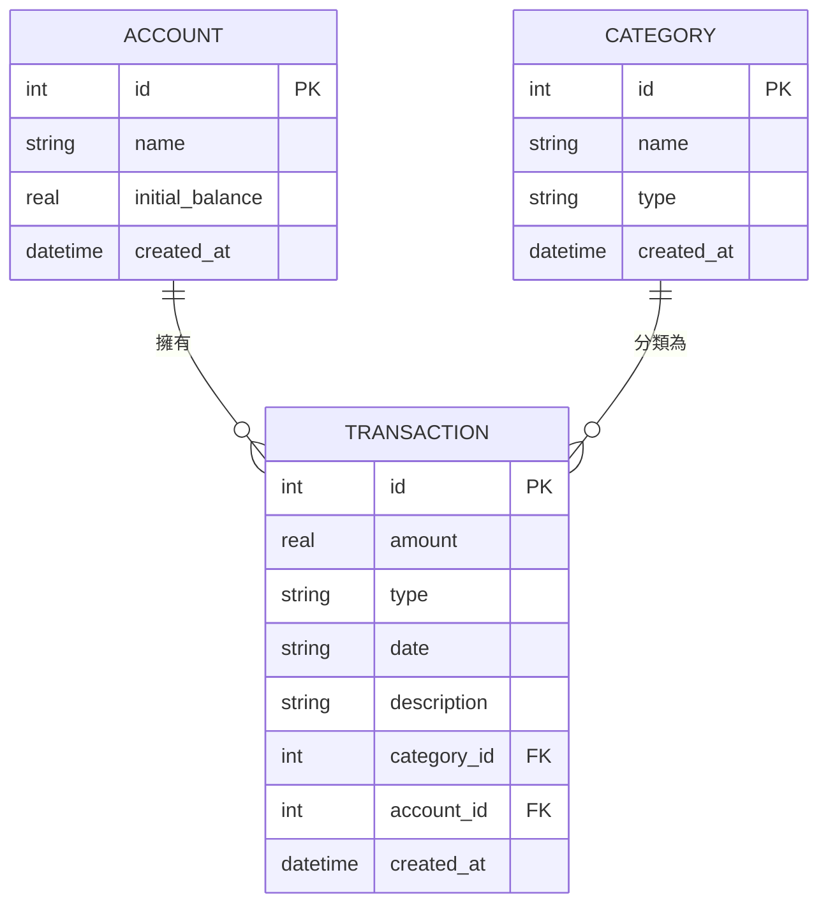

# 個人記帳簿系統 - 資料庫設計 (DB Design)

## 1. ER 圖 (實體關係圖)

## 2. 資料表詳細說明

### 2.1 ACCOUNT (帳戶資料表)
儲存使用者的各個帳戶或錢包資訊。
- `id` (INTEGER): 主鍵，自動遞增。
- `name` (TEXT): 帳戶名稱 (必填，如：現金、中國信託)。
- `initial_balance` (REAL): 初始餘額 (預設為 0.0，後續餘額由交易紀錄加總計算)。
- `created_at` (TEXT): 建立時間，ISO 8601 格式。

### 2.2 CATEGORY (分類資料表)
儲存收支的分類標籤。
- `id` (INTEGER): 主鍵，自動遞增。
- `name` (TEXT): 分類名稱 (必填，如：餐飲、薪水)。
- `type` (TEXT): 分類類型 (必填，`income` 收入 或 `expense` 支出)。
- `created_at` (TEXT): 建立時間，ISO 8601 格式。

### 2.3 TRANSACTION (收支紀錄表)
儲存每一筆收入或支出紀錄。
- `id` (INTEGER): 主鍵，自動遞增。
- `amount` (REAL): 交易金額 (必填，需大於 0)。
- `type` (TEXT): 收支類型 (必填，`income` 或 `expense`)。
- `date` (TEXT): 交易日期 (必填，YYYY-MM-DD 格式)。
- `description` (TEXT): 備註/說明 (選填)。
- `category_id` (INTEGER): 外鍵，關聯至 CATEGORY 的 id。
- `account_id` (INTEGER): 外鍵，關聯至 ACCOUNT 的 id。
- `created_at` (TEXT): 建立時間，ISO 8601 格式。

## 3. SQL 建表語法
建表語法請見 `database/schema.sql`，可直接執行以建立 SQLite 資料庫表結構。

## 4. Python Model 程式碼
Model 程式碼位於 `app/models/`，使用原生的 `sqlite3` 實作 CRUD 操作，輕量且快速。
- `__init__.py`: 負責資料庫連線。
- `account.py`: Account 的增刪改查。
- `category.py`: Category 的增刪改查。
- `transaction.py`: Transaction 的增刪改查。
