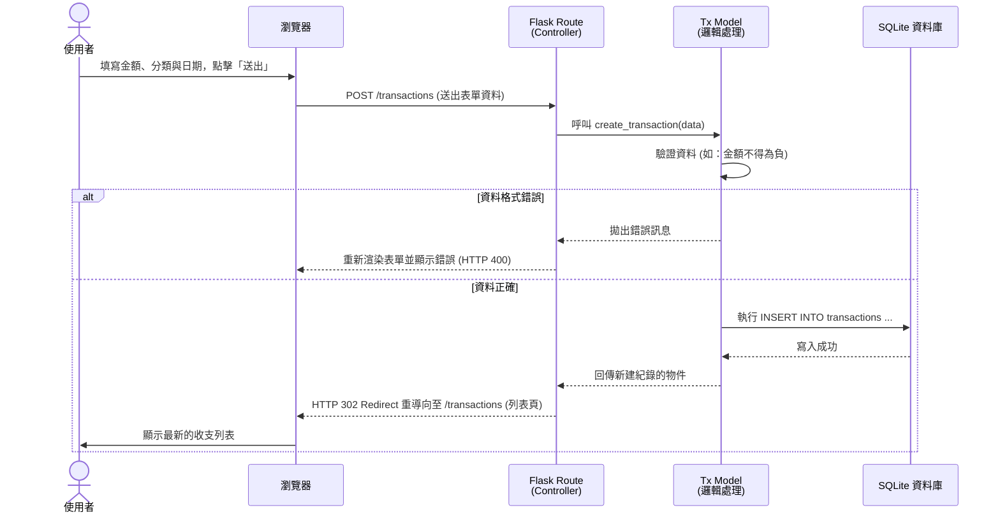

# 個人記帳簿系統 - 流程圖與系統流 (Flowcharts)

本文件基於 PRD 與系統架構文件，視覺化呈現使用者的操作路徑（User Flow）、新增收支時的系統內部資料流（System Flow），以及功能與路由的初步對照表。

---

## 1. 使用者流程圖 (User Flow)

此流程圖展示使用者進入系統後的各種主要操作路徑，包含瀏覽報表、管理收支、分類與帳戶。

```mermaid
flowchart LR
    A([使用者進入網站]) --> B[首頁 - 儀表板<br/>(總餘額與圖表)]
    
    B --> C{要執行什麼操作？}
    
    C -->|管理收支| D[收支紀錄列表]
    D --> D1[點擊「新增收支」] --> D2[填寫收支表單] --> D3[送出儲存] --> D
    D --> D4[點擊「編輯」] --> D5[修改收支表單] --> D3
    D --> D6[點擊「刪除」] --> D7[確認刪除] --> D
    
    C -->|管理分類| E[分類管理列表]
    E --> E1[新增自訂分類] --> E2[儲存] --> E
    
    C -->|管理帳戶| F[帳戶管理列表]
    F --> F1[新增帳戶/錢包] --> F2[儲存] --> F
    
    C -->|查看報表| G[詳細數據報表頁<br/>(含預算警告)]
    G --> B
```

---

## 2. 系統序列圖 (Sequence Diagram)

以下以系統中最核心的「新增收支紀錄」功能為例，展示從使用者點擊送出到資料寫入 SQLite，最終重新導向回列表頁的完整系統序列圖。



---

## 3. 功能清單與路由對照表

此表初步列出系統功能、預期的 URL 路徑與對應的 HTTP 請求方法，為接下來的 API 與路由實作提供參考基礎。

| 功能名稱 | URL 路徑 | HTTP 方法 | 說明 |
| --- | --- | --- | --- |
| **首頁儀表板** | `/` | `GET` | 顯示總餘額、圖表報表及預算警告 |
| **檢視收支紀錄** | `/transactions` | `GET` | 顯示所有收支列表 |
| **新增收支頁面** | `/transactions/new` | `GET` | 顯示新增收支的填寫表單 |
| **處理新增收支** | `/transactions` | `POST` | 接收表單並將收支資料存入資料庫 |
| **編輯收支頁面** | `/transactions/<id>/edit` | `GET` | 顯示修改特定收支的表單 |
| **處理編輯收支** | `/transactions/<id>` | `POST` | 接收修改資料並更新資料庫紀錄 |
| **刪除收支紀錄** | `/transactions/<id>/delete` | `POST` | 刪除特定收支紀錄 |
| **檢視分類列表** | `/categories` | `GET` | 顯示預設與自訂分類 |
| **處理新增分類** | `/categories` | `POST` | 接收表單並新增自訂分類 |
| **檢視帳戶列表** | `/accounts` | `GET` | 顯示現金、銀行等所有帳戶狀態 |
| **處理新增帳戶** | `/accounts` | `POST` | 接收表單並新增帳戶/錢包 |
